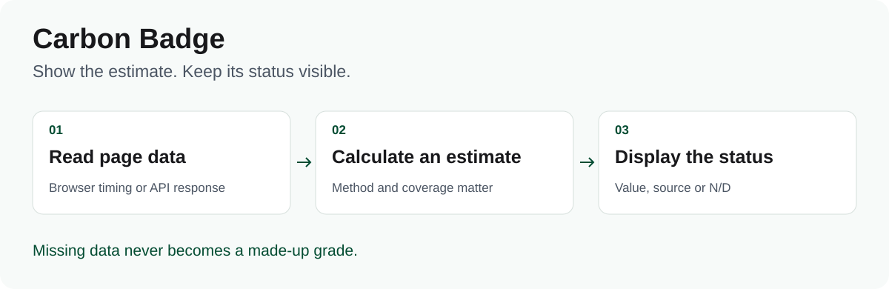
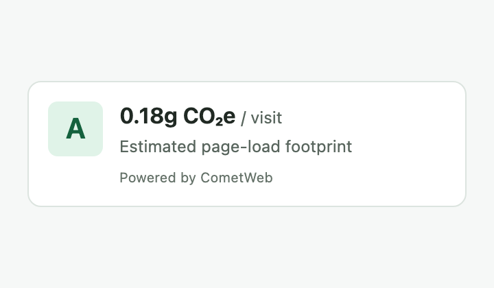
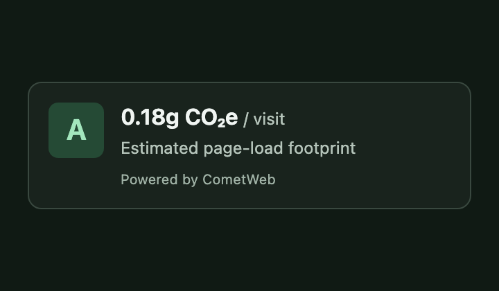
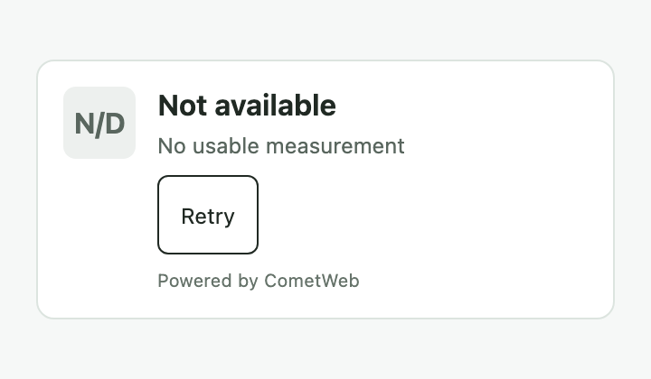
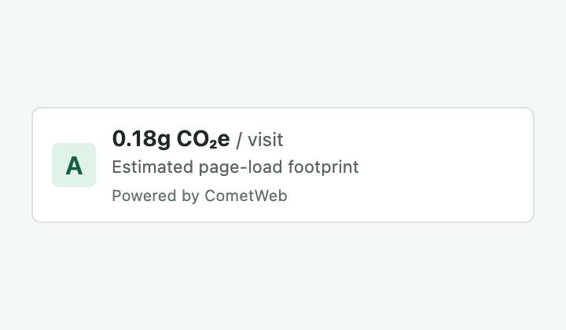
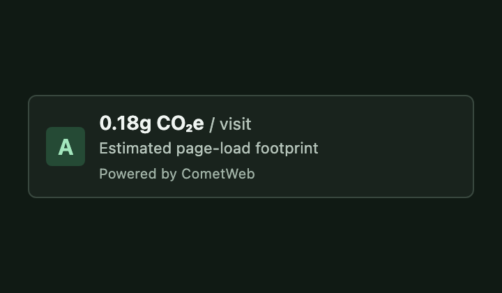
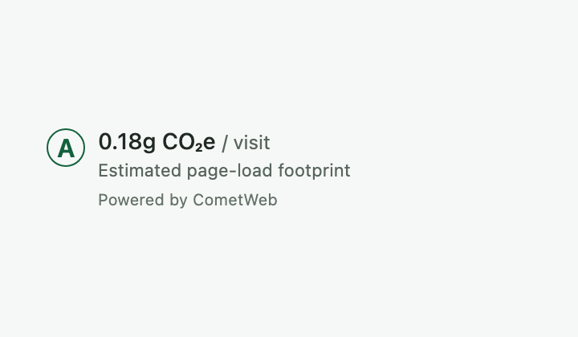
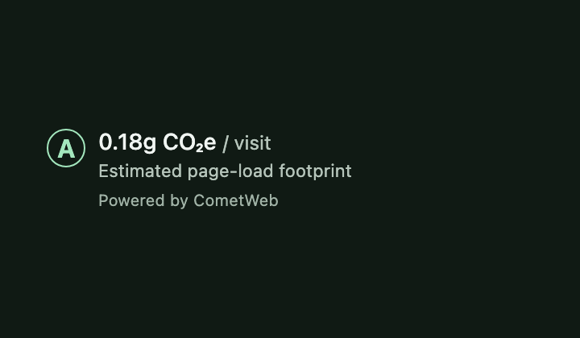

# CometWeb Carbon Badge

Add a small web component that displays estimated **CO₂e per page view**, its source and its measurement status.



[](LICENSE)

**Custom element · Light and dark themes · No runtime dependencies · 1.0.8**

## See the component

| Light | Dark | No measurement |
| :---: | :---: | :---: |
|  |  |  |

Real component screenshots with synthetic fixture data, not measurements of a live website. Flat colors, a compact grade tile and quiet attribution keep the estimate easy to read.

## Choose a look

| Variant | Light | Dark |
| --- | --- | --- |
| `default` — card |  |  |
| `compact` — small strip |  |  |
| `minimal` — footer signature |  |  |

```html
<cometweb-carbon-badge variant="compact" theme="light" mode="estimate"></cometweb-carbon-badge>
<cometweb-carbon-badge variant="minimal" theme="dark" mode="estimate"></cometweb-carbon-badge>
```

Omit `variant` for the default card. All variants retain the estimate, source/status and attribution. `minimal` has a transparent background: use the light theme on a light surface and dark on a dark surface. Changing the variant does not fetch a new measurement.

## Build and add it to a page

The code in this repository is version **1.0.8**. At the last documentation check (2026-09-19), npm's `latest` tag was **1.0.6** and the 1.0.8 CDN URL was unavailable. Use the source build below for the behavior documented here.

```bash
git clone https://github.com/CometWeb-io/Carbon-Badge.git
cd Carbon-Badge
npm ci
npm run build
```

Copy `dist/cometweb-carbon-badge.esm.js` to your site's public assets, for example `/vendor/`, then add:

```html
<script type="module" src="/vendor/cometweb-carbon-badge.esm.js"></script>
<cometweb-carbon-badge theme="light" mode="estimate"></cometweb-carbon-badge>
```

Serve the page over HTTP or HTTPS. This estimates the **current page** in the browser using available Resource Timing data. Missing or partial transfer data affects the result.

For a bundler, install the locally built package (`npm install /path/to/Carbon-Badge`) and use `import '@cometweb/carbon-badge';`. Check the published version before choosing a registry or CDN build.

## Choose a mode

| Mode | Data source | Setup |
| --- | --- | --- |
| `estimate` | Current page's browser transfer data and a simplified SWDM v4 calculation | Explicitly set `mode="estimate"` |
| `api` (default) | CometWeb's public carbon-badge endpoint | Network access; optionally set `url` and `api-url` |

An unavailable measurement displays **N/D**, not a made-up A+ score. A remote URL in API mode does not fall back to estimating the host page. API mode is an external service dependency; the component's MIT license does not guarantee service availability.

## Common options

```html
<cometweb-carbon-badge
  theme="dark"
  mode="estimate"
  green-host="false"
></cometweb-carbon-badge>
```

`green-host` is your assertion about hosting in estimate mode. It is not checked against a registry. Letter grades are fixed product bands; a percentile appears only when supplied by the API.

See the [full reference](docs/reference.md) for attributes, events, grades and methodology. This is an estimate of page-load footprint, not a sustainability certificate.

## Develop

```bash
npm ci
npm run build
npm test
npm run typecheck
```

Browser checks: `npm run test:e2e`. Packaging: `npm pack --dry-run`.

[MIT license](LICENSE) · [Changelog](CHANGELOG.md) · [Product page](https://cometweb.io/carbon-badge)
