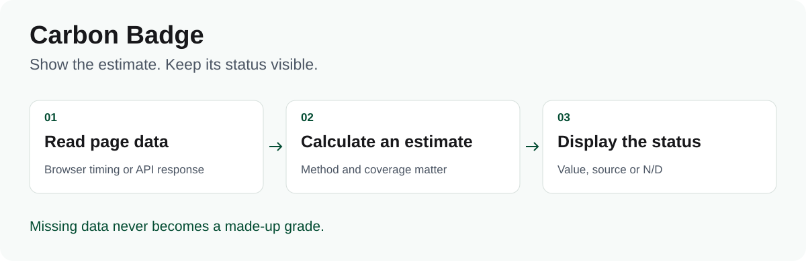
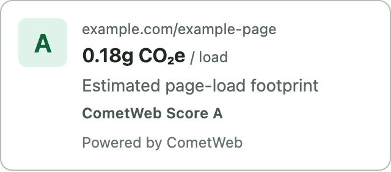
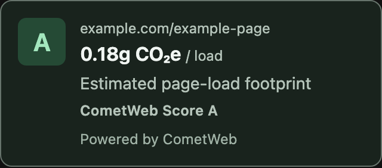
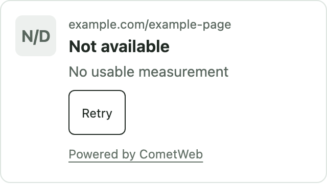
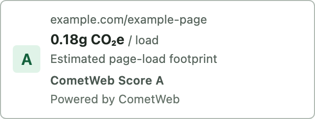
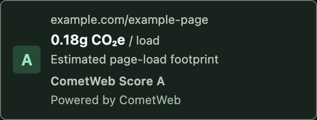
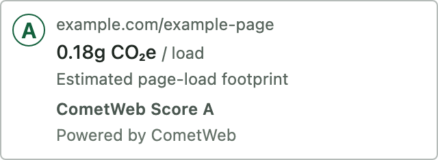
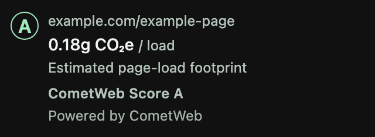

# CometWeb Carbon Badge

Web component that shows estimated **CO₂e for a first document load**, its source and measurement status. It has zero runtime dependencies, light/dark themes and three visual variants. The lightweight embed has a **10,500 B gzip initial-load CI budget**; the full SDK retains a **14,000 B** budget.



[](LICENSE)

The badge uses [CometWeb](https://cometweb.io) and documents a **SWDM v4 first-load lite approximation**. It is not a full visitor/cache model, an ESG certificate or a claim of a web-wide percentile. Product page: [cometweb.io/carbon-badge](https://cometweb.io/carbon-badge).

## Free embed: local by default

The default badge measures the current page in the visitor's browser. It makes **no score API requests**, starts no server scans, and reads or writes no localStorage or cookies. Loading a hosted script still creates an ordinary request to that file's hosting provider; self-host it to avoid that dependency.

Get the copy-ready snippet from the [installation page](https://cometweb.io/carbon-badge#install) when the release is available, or build this source and self-host the complete `dist/embed/` folder:

```html
<script type="module" src="/vendor/carbon-badge/2.0.3/carbon-badge.js"></script>
<cometweb-carbon-badge theme="dark"></cometweb-carbon-badge>
```

No account, API key or URL setup is needed. Local estimates describe this page load, not an average visitor or an entire website. Missing navigation timing, hidden resource sizes or a timing-buffer overflow produce **N/D**, with no letter grade. Incomplete data does not mean zero emissions. Cache hits and conditional revalidations are outside the first-load model and stay ungraded. SPA route changes cannot reuse the previous document timing as a new page score.

A late-loaded badge with 250 or more existing resource entries also stays ungraded: the default timing buffer may already have lost entries. This conservative guard can show N/D even if the host enlarged its buffer. Entries cleared or discarded by other scripts before initialization cannot be reconstructed.

For a hosted script, use a versioned directory and the exact entry SRI from its verified release manifest. Cross-origin delivery needs `Access-Control-Allow-Origin: *` on every module; exposing its timing also needs `Timing-Allow-Origin: *`. Entry SRI does not verify dynamically imported chunks. Use the single-file SDK when one SRI must cover all JavaScript. Do not invent a hash or assume a candidate version is already on npm/CDN.

## See the component

| Light | Dark | No measurement |
| :---: | :---: | :---: |
|  |  |  |

These are component screenshots with synthetic fixture data, not measurements of a live website.

## Choose a look

| Variant | Light | Dark |
| --- | --- | --- |
| `default` — card |  |  |
| `compact` — small strip |  |  |
| `minimal` — footer signature |  |  |

```html
<cometweb-carbon-badge variant="compact" theme="light" mode="estimate"></cometweb-carbon-badge>
<cometweb-carbon-badge variant="minimal" theme="dark" mode="estimate"></cometweb-carbon-badge>
```

Omit `variant` for the default card. All variants retain the estimate, measured host/path, source/status and attribution. `minimal` has a transparent background: use the light theme on a light surface and dark on a dark surface. Changing the variant does not fetch a new measurement.

## Install and add it to a page

The code in this repository is release candidate **2.0.3** (not a claim of npm/CDN publication). Build it locally when you need the exact behavior documented here:

Build the reviewed candidate checkout with Node.js 22 or newer. A clone of `main` contains the latest committed source; it does not contain uncommitted changes or establish npm/CDN publication.

```bash
git clone https://github.com/CometWeb-io/Carbon-Badge.git
cd Carbon-Badge
npm ci
npm run build
```

Copy the entire `dist/embed/` folder to `/vendor/carbon-badge/2.0.3/`, preserving `chunks/` and file names, then add:

```html
<script type="module" src="/vendor/carbon-badge/2.0.3/carbon-badge.js"></script>
<cometweb-carbon-badge theme="light" mode="estimate"></cometweb-carbon-badge>
```

For a bundler, install the built package (`npm install /path/to/Carbon-Badge`) and use `import '@cometweb/carbon-badge/embed';`. Keep dynamic imports as separate chunks in the production bundler configuration to retain the initial-load saving.

## Package entry points

All entry points belong to one npm package and share its version.

| Import | Purpose | Production gzip budget |
| --- | --- | ---: |
| `@cometweb/carbon-badge/embed` | ESM side effect: registers the component; API/cache code loads only in a visible API or snapshot mode | 10,500 B initially / 15,000 B with all network chunks |
| `@cometweb/carbon-badge/api` | API client and response parser, without registering the component; ESM and CommonJS | 3,500 B per format |
| `@cometweb/carbon-badge` | Existing full SDK with named exports and automatic registration; single-file ESM and UMD | 14,000 B per format |

The embed is a side-effect entry with no public named exports. Use the root SDK for `CometWebCarbonBadge`, scoring helpers or programmatic registration, and `/api` for `fetchSingleFlight`, `parseApiResponse`, API URL validation and retry-delay helpers. Existing root imports keep their API.

Local mode never requests the optional module. API/snapshot mode loads it once per page; subsequent badge instances and reloads reuse the browser's module cache. The complete network embed has a 15,000 B gzip budget, slightly larger than the single-file SDK budget. Splitting reduces initial local loading, not every integration's total download.

Publish each embed directory as one immutable version. Copying only the entry, renaming it, or changing just its query string can break relative module resolution or mix versions. Serve all JavaScript with a JavaScript MIME type. CSP `script-src` must permit the module origin; network modes additionally need `connect-src https://app.cometweb.io`. `dist/release-manifest.json` records the module graph and every artifact's hash/SRI, including the optional chunk; chunk file names alone are not an integrity guarantee.

## Choose a mode

| Mode | Data source | Setup |
| --- | --- | --- |
| `estimate` (default) | Current page Resource Timing and simplified SWDM v4 calculation | No account, network score request or storage |
| `snapshot` (advanced) | Published CometWeb measurement | Set `snapshot-id`; requires a working publication/proof service |
| `api` (advanced) | CometWeb public carbon-badge endpoint | Explicit `mode="api"`; reads an owner-published result by URL, without starting a scan |

An unavailable measurement displays **N/D**, not a made-up A+ score. A remote URL in API mode never falls back to estimating the host page. API mode is an external service dependency; the component's MIT license does not guarantee service availability.

## Common options

```html
<cometweb-carbon-badge
  mode="estimate"
  variant="compact"
  theme="light">
</cometweb-carbon-badge>
```

`green-host` is a legacy attribute and is ignored in local mode. The badge does not verify hosting claims. Letter grades are fixed product bands; a percentile appears only when supplied by the API.

| Attribute | Default | Description |
| --- | --- | --- |
| `url` | current page URL | Published page URL to look up in API mode; public identity is origin + pathname (query and fragment always stripped) |
| `snapshot-id` | — | Published CometWeb public ID; selects snapshot mode when `mode` is omitted |
| `mode` | `estimate` or `snapshot` with ID | `snapshot` — published result; `api` — published result lookup; `estimate` — client-side SWDM v4 first-load lite |
| `variant` | `default` | `default` card, `compact` strip or `minimal` transparent signature; changes do not reload data |
| `theme` | `dark` | Allowlisted: `dark` or `light` |
| `cache-ttl` | `720` | Client cache TTL for cacheable API responses only; published snapshots and `Cache-Control: no-store` are always fetched again |
| `green-host` | `false` | Legacy, ignored in local mode |
| `lang` | document language | `pl` or `en`; other languages use English |
| `loading` | lazy in network modes | `eager` fetches immediately; local measurement always starts after page quiescence |
| `nonce` | — | Host-provided CSP nonce for the fallback style element |

Do not combine `snapshot-id` with `mode="api"` or `mode="estimate"`: the badge shows **N/D** without starting a scan or calculating a local grade. Omit `mode` or use `mode="snapshot"` for a published ID. An empty `snapshot-id` also shows **N/D**.

`api-url` / `api-key` are not public attributes. Only explicitly selected network modes talk to `https://app.cometweb.io/api`. Local mode makes no result requests.

## Modes and provenance

- **`snapshot`** fetches `GET /public/carbon-badge/id/{public_id}`. It never starts a URL scan. Invalid, missing, mismatching, malformed, stale, partial or revoked snapshots render **N/D**. The client requires the response to identify the same published snapshot with valid measurement and freshness dates.
- **`api`** fetches `GET /public/carbon-badge`. Invalid or empty payloads render **N/D**. A remote `url` never falls back to estimating the host page. Published results are rechecked on each load so a revoked snapshot cannot be shown from local storage.
- URL mode removes every query parameter. If a backend snapshot is indexed by a semantic query (for example `?item=123`), embed its `snapshot-id`; the query-free URL request will not select that snapshot.
- An API result labeled `cometweb_scan` keeps that measurement source. It is not treated as a published snapshot, even if the payload includes a public ID or evidence URL.
- An unrecognized or malformed `measurement_source` renders **N/D** instead of being relabeled `api`. Source-less legacy API responses retain the `api` fallback.
- **`estimate`** waits for page quiescence, measures transfer with Resource Timing, then applies `swdm-v4-lite-first-load-v1`. DOM size is never used as a carbon score. Missing timing renders **N/D**.

Cheap published snapshot read on the server: `GET /api/public/carbon-badge/id/{public_id}` — no HTTP re-scan.

### Footer label

| Condition | Footer text |
| --- | --- |
| Published snapshot returns `status: ready` over the network, a public ID, fresh dates, and an evidence URL bound to `/carbon-badge/{publicId}` on an allowlisted CometWeb origin | **Published by CometWeb** |
| Estimate mode, stale/partial/revoked/unknown result, or untrusted/missing evidence | **Powered by CometWeb** |

## Scoring and methodology

Letters are the **CometWeb Carbon Score** (`carbon-badge-bands-v1`) — product bands, not the public Digital Carbon Rating Scale.

| CometWeb Score | CO₂e / page load | Meaning |
| --- | ---: | --- |
| A+ | < 0.10 g | Exceptionally clean |
| A | < 0.20 g | Very clean |
| B | < 0.40 g | Band B |
| C | < 0.70 g | Band C |
| D | < 1.00 g | Band D |
| F | ≥ 1.00 g | High emissions |

```text
CO₂e = data_GB × (E_operational + E_embodied) × grid_intensity

E_operational = 0.055 × (1 − greenHostingFactor) + 0.059 + 0.080 kWh/GB
E_embodied = 0.012 + 0.013 + 0.081 kWh/GB
grid_intensity = 494 gCO₂e/kWh
```

`data_GB` uses `bytes / 1,000,000,000`. In estimate mode, `green-host="true"` is ignored and does not change `greenHostingFactor` (always 0 in local estimate mode). See the [full reference](docs/reference.md) for the complete contract.

## Privacy and trust

URL query parameters and fragments are never retained in badge identity, requests, cache keys or event URLs. The removed `allow-query` attribute is ignored. The page pathname is still visible to an explicitly selected remote API: never use those modes for private pages.

“Published” describes the source of a snapshot, not domain ownership, independent verification or certification. `originMatched` only reports an API placement check; it is `null` when absent or not obtained over the network. No missing proof URL is manufactured from a public ID.

## Events

| Event | When |
| --- | --- |
| `cometweb:badge-load` | Data rendered (`detail`: url, co2Grams, score, measurementSource, retrievalSource, status, formulaId, scoreModelId, published, originMatched, …) |
| `cometweb:badge-error` | Measurement failed (`detail`: sanitized `url`, `mode`, `reason`, `status`, resource visibility counts) |

```js
document.querySelector('cometweb-carbon-badge')
  ?.addEventListener('cometweb:badge-load', (event) => {
    console.log(event.detail.score, event.detail.co2Grams, event.detail.status);
  });
```

## Build and test

```bash
npm ci
npm run build
npm test
npm run typecheck
npm run typecheck:test
npm run clean && NODE_ENV=production npm run build
npm run size:check
npm run security:audit
NODE_ENV=production npm run sri
npm run pack:consumer
npm run test:e2e
npm pack --dry-run
```

Pull requests also run CodeQL and dependency review. Pushes to `main` produce a CycloneDX SBOM and an attested package artifact; the workflow does not publish to npm automatically.

For a locally running production build of the installation page, run
`BADGE_MARKETING_ORIGIN=http://127.0.0.1:4186 npm run test:marketing`.
This checks exact artifact bytes, cross-origin delivery with SRI, the EN/PL
configurator and narrow layouts in Chromium, Firefox and WebKit. It is separate
from package E2E and does not publish or deploy anything. The manually dispatched `marketing-gate.yml` workflow tests the HTTPS origin configured in the repository variable `BADGE_MARKETING_ORIGIN`. Publication requires a successful run on the exact release commit and a matching receipt no older than seven days. Stage the matching installer before running that gate; unrelated OSS pull requests do not need a live installation site.

See [CHANGELOG.md](./CHANGELOG.md) for release notes.

[MIT license](LICENSE) · [Changelog](CHANGELOG.md) · [Product page](https://cometweb.io/carbon-badge)

## Freshness, accessibility and response limits

API and snapshot modes wait until the badge is within 200 px of the viewport; use `loading="eager"` when an immediate request is required. Browsers without IntersectionObserver fetch immediately. A result with `validUntil` is rechecked at expiry; an error, revoked or expired response removes the grade. Local instances share one document URL watcher. It handles popstate/hashchange immediately and polls once per second for History API changes. SPA navigation invalidates the previous first-load result. A persisted pageshow event rechecks a restored badge, including network publication status. Background throttling can delay that check; call `reload()` for immediate invalidation. It cannot reconstruct a separate route measurement.

Set `lang="pl"` for Polish or `lang="en"` for English. Numbers and dates follow that locale; changing language or variant does not request new data. Supporting text is at least 12 px; reduced motion and forced colors are supported. The transparent minimal variant needs a matching host background. The browser suite checks all themes/variants at 200% zoom, RTL, axe rules and a nonce-based strict CSP fallback. Automated checks do not replace screen-reader user testing.

For a nonce-based `style-src`, provide the same nonce on the component, for example `<cometweb-carbon-badge nonce="SERVER_NONCE" lang="pl"></cometweb-carbon-badge>`. Generate a fresh nonce per response; do not copy the fixture nonce. Policies that forbid both constructable styles and nonce-bearing inline styles need a different integration.

Measurement URLs are limited to 4096 characters after normalization; snapshot IDs to 64 hex characters. Network responses have a 65536-byte decoded body cap and an end-to-end timeout (8 seconds in the component). Redirects are rejected. Concurrent identical GETs share a read-only envelope; distinct options and mutations do not share it. Disconnecting one badge cancels only its subscription, and the final subscriber aborts the upstream request.

See [the reference](docs/reference.md), [versioned model factors](docs/model-factors.json) and [provider response schema](docs/api-response.schema.json). The schema describes the producer contract; the consumer retains documented legacy compatibility. This repository has not established acceptance against the deployed backend for this candidate.

The [security boundaries](docs/security-boundaries.md) describe trusted inputs, failure behavior and verification limits. Python serializer and URL-identity fixtures live in `docs/fixtures/`; they use synthetic data and contain no customer records.
